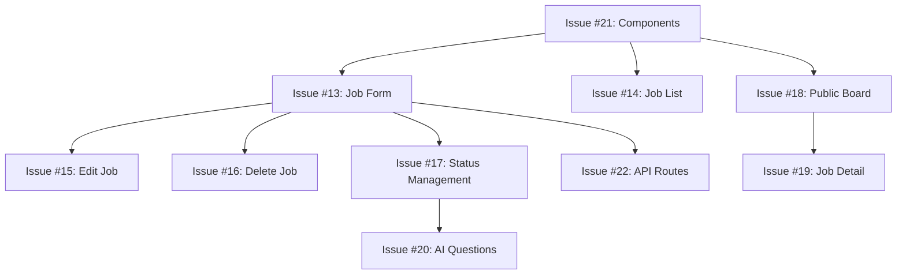

# Sprint 2: Job Management

**Duration**: Weeks 3-4 (2 weeks)
**Goal**: Companies can create, manage, and publish jobs with AI-generated questions

---

## 🎯 Sprint Goal

By the end of Sprint 2, companies should be able to:
- ✅ Create job postings with comprehensive details
- ✅ Manage their job listings (edit, delete, status changes)
- ✅ View public job board with all active positions
- ✅ See AI-generated interview questions for each job

---

## 📋 Sprint Backlog

### Issue #13: Job Creation Form ⭐ HIGH PRIORITY
**Story**: As a company, I want to create a job posting so that I can attract candidates

**Tasks**:
- [ ] Create `/dashboard/jobs/new` page
- [ ] Build JobForm component with all fields:
  - Job title
  - Company name (auto-filled from user profile)
  - Department
  - Location (remote/hybrid/onsite + city)
  - Job type (full-time, part-time, contract, internship)
  - Experience level (entry, mid, senior, lead)
  - Salary range (optional)
  - Job description (rich text editor)
  - Requirements (skills, qualifications)
  - Benefits
- [ ] Add form validation (Zod schema)
- [ ] Save job to Supabase `jobs` table
- [ ] Add success/error notifications
- [ ] Handle loading states

**Acceptance Criteria**:
- Form validates all required fields
- Job saves successfully to database
- User redirected to job list after creation
- Error handling works for network failures

**Story Points**: 5

---

### Issue #14: Job Listing Page (Company View)
**Story**: As a company, I want to see all my job postings in one place

**Tasks**:
- [ ] Create `/dashboard/jobs` page
- [ ] Fetch jobs from Supabase (filtered by company)
- [ ] Build JobCard component showing:
  - Job title
  - Department
  - Location
  - Status badge (draft, active, closed)
  - Number of applicants
  - Created date
  - Quick actions (edit, delete, view)
- [ ] Add empty state ("Create your first job")
- [ ] Add loading skeleton
- [ ] Implement error handling

**Acceptance Criteria**:
- Shows all jobs for logged-in company
- Jobs grouped/sorted by status
- Empty state displays when no jobs
- Cards are clickable and navigate to job detail

**Story Points**: 3

---

### Issue #15: Edit Job Functionality
**Story**: As a company, I want to edit my job postings to keep them up-to-date

**Tasks**:
- [ ] Create `/dashboard/jobs/[id]/edit` page
- [ ] Reuse JobForm component
- [ ] Pre-populate form with existing job data
- [ ] Update job in Supabase
- [ ] Handle validation errors
- [ ] Show success message after update
- [ ] Redirect to job detail page

**Acceptance Criteria**:
- Form loads with existing job data
- Updates save successfully
- User sees confirmation message
- Changes reflected immediately

**Story Points**: 3

---

### Issue #16: Delete Job Functionality
**Story**: As a company, I want to delete job postings that are no longer relevant

**Tasks**:
- [ ] Add delete button to job card
- [ ] Create confirmation dialog/modal
- [ ] Implement soft delete (set status to 'deleted')
- [ ] Update UI to remove deleted job
- [ ] Handle errors gracefully
- [ ] Add toast notification

**Acceptance Criteria**:
- Confirmation required before deletion
- Job removed from list after deletion
- Related data handled properly (cascade or restrict)
- Undo option available (bonus)

**Story Points**: 2

---

### Issue #17: Job Status Management
**Story**: As a company, I want to change job status (draft, active, closed)

**Tasks**:
- [ ] Add status dropdown to job card
- [ ] Implement status update logic
- [ ] Update database on status change
- [ ] Show visual feedback (badge color changes)
- [ ] Add confirmation for status changes
- [ ] Prevent applications on closed jobs

**Acceptance Criteria**:
- Status changes reflect immediately
- Closed jobs don't accept applications
- Draft jobs not visible on public board
- Active jobs appear on job board

**Story Points**: 2

---

### Issue #18: Public Job Board ⭐ HIGH PRIORITY
**Story**: As a candidate, I want to see all available jobs so I can find opportunities

**Tasks**:
- [ ] Create `/jobs` page (public, no auth required)
- [ ] Fetch active jobs from Supabase
- [ ] Display jobs in grid/list layout
- [ ] Add basic filters:
  - Location
  - Job type
  - Experience level
  - Department
- [ ] Add search functionality (by title/description)
- [ ] Make responsive for mobile
- [ ] Add pagination or infinite scroll

**Acceptance Criteria**:
- Public page accessible without login
- Shows only active jobs
- Filters work correctly
- Mobile-friendly layout
- Fast loading (<2s)

**Story Points**: 5

---

### Issue #19: Job Detail Page (Public)
**Story**: As a candidate, I want to view job details so I can decide if I want to apply

**Tasks**:
- [ ] Create `/jobs/[id]` page (public)
- [ ] Fetch job details from Supabase
- [ ] Display comprehensive job information:
  - Title, company, location
  - Job description (formatted)
  - Requirements
  - Benefits
  - Salary range (if provided)
  - Posted date
- [ ] Add "Apply Now" button (links to application form)
- [ ] Add share functionality (copy link)
- [ ] Show related jobs (same department/location)
- [ ] Add SEO meta tags

**Acceptance Criteria**:
- All job details displayed clearly
- Apply button navigates to application form
- 404 page for non-existent jobs
- SEO optimized for search engines

**Story Points**: 4

---

### Issue #20: AI Question Generation Integration ⭐ HIGH PRIORITY
**Story**: As a company, I want AI to generate interview questions when I publish a job

**Tasks**:
- [ ] Create server action for question generation
- [ ] Integrate `/api/generate-questions` endpoint
- [ ] Trigger generation when job status → 'active'
- [ ] Store questions in `question_templates` table
- [ ] Show loading state during generation
- [ ] Display generated questions to company
- [ ] Add regenerate button (optional)
- [ ] Handle API errors gracefully

**Acceptance Criteria**:
- Questions auto-generate on job activation
- Questions stored in database
- Company can review questions
- Error handling for API failures
- Loading state provides feedback

**Story Points**: 5

---

### Issue #21: Job Form UI Components
**Story**: As a developer, I need reusable components for job management

**Tasks**:
- [ ] Create JobCard component
- [ ] Create JobForm component
- [ ] Create JobStatusBadge component
- [ ] Create JobFilters component
- [ ] Create JobSearchBar component
- [ ] Add TypeScript types for Job
- [ ] Write component documentation

**Acceptance Criteria**:
- Components are reusable
- Props properly typed
- Components responsive
- Accessible (ARIA labels)

**Story Points**: 3

---

### Issue #22: Job Management API Routes
**Story**: As a developer, I need API routes for job operations

**Tasks**:
- [ ] Create `app/api/jobs/route.ts` (GET, POST)
- [ ] Create `app/api/jobs/[id]/route.ts` (GET, PUT, DELETE)
- [ ] Add authentication checks
- [ ] Validate request data
- [ ] Handle errors with proper status codes
- [ ] Add rate limiting (optional)
- [ ] Write API documentation

**Acceptance Criteria**:
- All CRUD operations work
- Authentication enforced
- Proper error responses
- Request validation implemented

**Story Points**: 4

---

## 📊 Sprint Metrics

**Total Story Points**: 36
**Team Capacity**: ~40 points (2 weeks, 1-2 developers)
**Velocity Target**: 30-36 points

---

## 🏆 Definition of Done

A task is complete when:

✅ **Code Quality**
- Code written and tested locally
- TypeScript types properly defined
- No console errors or warnings
- Follows project code style

✅ **Testing**
- Manual testing completed
- Edge cases handled
- Error states tested
- Mobile responsiveness verified

✅ **Review & Deploy**
- Pull request created
- Code reviewed (if team)
- Merged to production branch
- Deployed to Vercel
- Verified on staging/production

✅ **Documentation**
- Comments added for complex logic
- README updated if needed
- API documented (if new endpoints)

---

## 🚀 Sprint Schedule

### Week 1 (Days 1-5)
**Focus**: Job CRUD functionality

**Monday**: Sprint planning, start Issue #13 (Job Creation Form)
**Tuesday-Wednesday**: Complete Issues #13, #14
**Thursday**: Issues #15, #16 (Edit & Delete)
**Friday**: Issue #17 (Status Management), Week 1 Review

### Week 2 (Days 6-10)
**Focus**: Public job board and AI integration

**Monday**: Issue #18 (Public Job Board)
**Tuesday**: Issue #19 (Job Detail Page)
**Wednesday-Thursday**: Issue #20 (AI Questions), Issue #21 (Components)
**Friday**: Issue #22 (API Routes), Sprint Demo & Retro

---

## 🎨 UI/UX Requirements

### Design Principles
- Clean, modern interface
- Consistent with Sprint 1 design
- Mobile-first approach
- Fast interactions (<100ms feedback)
- Clear error messages

### Job Form Design
- Progressive disclosure (show advanced fields on click)
- Rich text editor for job description
- Character counter for limits
- Auto-save draft functionality (bonus)

### Job Board Design
- Grid layout (3 columns desktop, 1 mobile)
- Prominent "Apply" button
- Company logo support (future)
- Visual hierarchy (title > company > location)

---

## 🔧 Technical Implementation

### Database Queries
```sql
-- Fetch company's jobs
SELECT * FROM jobs
WHERE created_by = auth.uid()
ORDER BY created_at DESC;

-- Fetch public active jobs
SELECT * FROM jobs
WHERE status = 'active'
ORDER BY created_at DESC;

-- Update job status
UPDATE jobs
SET status = 'active', updated_at = NOW()
WHERE id = :job_id AND created_by = auth.uid();
```

### Key Dependencies
- `@tiptap/react` - Rich text editor (optional)
- `react-hook-form` - Form management
- `zod` - Schema validation
- `lucide-react` - Icons

### File Structure
```
app/
├── dashboard/
│   └── jobs/
│       ├── page.tsx              # Job listing
│       ├── new/
│       │   └── page.tsx          # Create job
│       └── [id]/
│           ├── page.tsx          # Job detail (company view)
│           └── edit/
│               └── page.tsx      # Edit job
├── jobs/
│   ├── page.tsx                  # Public job board
│   └── [id]/
│       └── page.tsx              # Public job detail
└── api/
    ├── jobs/
    │   ├── route.ts
    │   └── [id]/
    │       └── route.ts
    └── generate-questions/
        └── route.ts
```

---

## 🧪 Testing Checklist

### Job Creation
- [ ] Create job with all required fields
- [ ] Create job with optional fields empty
- [ ] Validate required field errors
- [ ] Test with very long job descriptions
- [ ] Test with special characters in title
- [ ] Verify job appears in job list

### Job Management
- [ ] Edit existing job
- [ ] Delete job (with confirmation)
- [ ] Change job status (draft → active → closed)
- [ ] Filter jobs by status
- [ ] Search jobs by title

### Public Job Board
- [ ] View all active jobs as guest
- [ ] Filter jobs by location
- [ ] Filter by job type
- [ ] Search functionality
- [ ] Mobile responsiveness
- [ ] Pagination/infinite scroll

### AI Integration
- [ ] Generate questions for new job
- [ ] View generated questions
- [ ] Handle API timeout
- [ ] Handle API error
- [ ] Verify questions stored in DB

---

## 📈 Success Metrics

**Sprint Success Criteria**:
- All 10 issues completed (or 90% story points)
- Zero critical bugs
- Job creation flow works end-to-end
- Public job board functional
- AI questions generate successfully

**User Success Metrics** (post-sprint):
- Companies create 10+ jobs
- Job board receives 100+ views
- AI questions generated for 100% of active jobs
- Zero job creation errors

---

## ⚠️ Risks & Mitigation

| Risk | Probability | Impact | Mitigation |
|------|-------------|--------|------------|
| Claude API rate limits | Medium | High | Cache prompts, use Haiku model, set lower limits |
| Complex job form takes longer | High | Medium | Start early, use react-hook-form for speed |
| Public job board performance | Low | Medium | Add pagination, database indexes |
| AI questions not relevant | Medium | High | Fine-tune prompts, allow regeneration |

---

## 🔄 Dependency Flow



**Recommended Order**:
1. Issue #21 (Components) - Foundation
2. Issue #22 (API Routes) - Backend
3. Issue #13 (Job Form) - Core feature
4. Issue #14 (Job List) - View jobs
5. Issue #15 (Edit) - Manage jobs
6. Issue #16 (Delete) - Manage jobs
7. Issue #17 (Status) - Workflow
8. Issue #18 (Public Board) - Public facing
9. Issue #19 (Job Detail) - Public facing
10. Issue #20 (AI Questions) - AI integration

---

## 💡 Optional Enhancements (If Time Permits)

- [ ] Job templates (save as template)
- [ ] Duplicate job functionality
- [ ] Job preview before publishing
- [ ] Email notification when job is published
- [ ] Analytics (job views, clicks)
- [ ] Social media share buttons
- [ ] Apply with LinkedIn integration

---

## 🎉 Sprint Demo Preparation

**What to demonstrate** (Friday Week 2):

1. **Job Creation Flow** (5 min)
   - Create a job from dashboard
   - Show form validation
   - Show AI questions generation

2. **Job Management** (5 min)
   - Edit existing job
   - Change job status
   - Delete a job

3. **Public Job Board** (5 min)
   - Browse jobs as candidate
   - Use filters and search
   - View job details

4. **Technical Highlights** (5 min)
   - Show AI integration
   - Demonstrate error handling
   - Mobile responsiveness

**Demo Script Template**:
```
"Today we completed Sprint 2 - Job Management. Let me show you what companies can now do:

1. [Show job creation] Companies can create detailed job postings with all necessary information
2. [Show AI questions] When published, AI automatically generates relevant interview questions
3. [Show job list] Companies can manage all their jobs in one place
4. [Show public board] Candidates can now browse and search active jobs
5. [Show job detail] Each job has a dedicated page with full details and an apply button

Key wins this sprint:
- 10 features delivered
- AI question generation working perfectly
- Public job board live and responsive
- Zero critical bugs

Next sprint: We'll build the application submission flow!"
```

---

## 📝 Retrospective Prompts

### What Went Well?
- What features were completed smoothly?
- Which technical decisions paid off?
- What collaboration worked well?

### What Could Be Improved?
- What took longer than expected?
- What technical debt was created?
- What blockers did we face?

### Action Items for Sprint 3
- What should we do differently?
- What skills do we need to learn?
- What process improvements can we make?

---

## 📚 Resources & References

### Documentation
- [Next.js App Router](https://nextjs.org/docs/app)
- [Supabase CRUD](https://supabase.com/docs/guides/database/tables)
- [React Hook Form](https://react-hook-form.com/)
- [Zod Validation](https://zod.dev/)

### Design Inspiration
- [Wellfound Jobs](https://wellfound.com/jobs)
- [LinkedIn Jobs](https://www.linkedin.com/jobs/)
- [Indeed](https://www.indeed.com/)

### AI Prompt Examples
```
Generate 8 interview questions for a [job_title] position at a [company_type].

Requirements:
- Include technical, behavioral, and situational questions
- Match [experience_level] level
- Focus on [key_skills]
- Each question should evaluate [job_description]
```

---

## ✅ Sprint Checklist

### Before Starting
- [ ] Review Sprint 1 retrospective notes
- [ ] Ensure all Sprint 1 items deployed
- [ ] Set up Sprint 2 milestone on GitHub
- [ ] Create all 10 issues with labels
- [ ] Assign story points to each issue
- [ ] Schedule sprint planning meeting

### During Sprint
- [ ] Daily standups (or async updates)
- [ ] Update issue status daily
- [ ] Deploy to staging frequently
- [ ] Test features on staging
- [ ] Document any technical decisions

### Before Sprint End
- [ ] All issues moved to "Done"
- [ ] All code merged and deployed
- [ ] Demo prepared
- [ ] Retrospective notes ready

---

**Let's build an amazing job management system! 🚀**

**Sprint Start Date**: [To be scheduled]
**Sprint End Date**: [2 weeks from start]
**Next Sprint Planning**: [Friday of Week 2]
